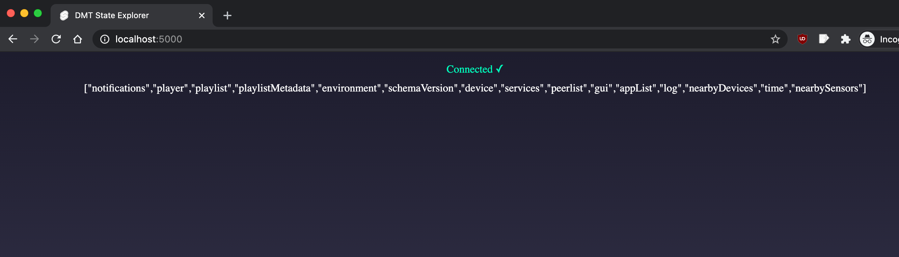

## Get started

Install the dependencies...

```bash
cd dmt-insight
npm install
```

...then start [Rollup](https://rollupjs.org):

```bash
npm run dev
```

Navigate to [localhost:5000](http://localhost:5000). You should see your app running.

## dmt-proc

You have to have `dmt-proc` running on localhost as well. This frontend willconnect to it and display this:



## Technical

`App.svelte` simply gets two Svelte stores:

```html

<script>
  export let connected;
  export let state;
</script>
```

`$connected` readable store (true/false) tells if the gui is currently connected to backend.

`$state` is the entire state of `dmt-proc` also obtainable through command line with `dmt state`

## Goal

First step is to design a nice user interface for quickly exploring this simple reactive JSON object. Should have syntax highlighting (keys vs values), explanding and collapsing in a simple way etc.

In next steps we will focus on more custom-tailored views for a few sub-values of this state like `nearbyDevices`, `peerlist` and some others... `connections` is not yet part of state (obtainable via `dmt connections` cli command), we will decide a bit later how to pass this to gui so that it can render the table in similar way as for `nearbyDevices`....

`log` subvalue of state currently holds only a few recent log entries but please show this already... log entries should be shown in color (they are ANSI)... this is already partially implemented in `http://localhost:7777/device` view... source code for DMT-GUI is not in repo (only bundle)... if you need example code for showing ANSI in frontend, tell so.. however this old implementation has problems with long lines (they don't wrap or respond to smaller window sizes and so information is sometimes lost in the view).

When `Connectome` library progresses a bit more we will implement infinite scrolling (pagination) of the entire log which will then be possible to be checked from GUI.. for now you can focus on just these last few lines that are present as part of state... After we have a better method, this will work with RPC calls over the same connection and `log` will be removed from `state` because it doesn't actually belong there.

So this first proof of concept is an experiment to see in which direction to go.. but for sure we need a much improved `device` view / state / log explorer... nearby / connections / peerlist table etc. All of this can be barely usable from GUI if implemented wrong and can on the other hand be amazing if GUI is modern, fast, reactive, responsive etc. Then checking out the node status / diagnostics in this manner can be a joy. And all of this is cruical information for the node operator to sometimes check (for education or in case of issues).

Tnx.

