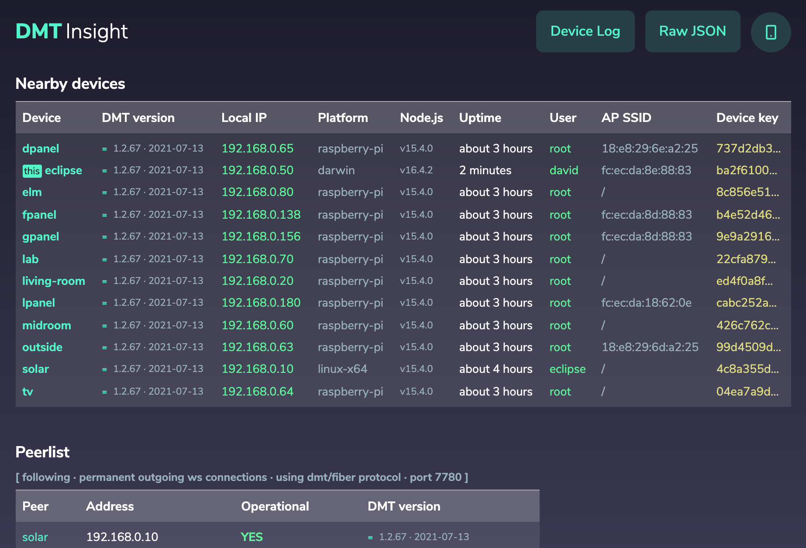

# DMT Insight

<p align="center"></p>

This app is already bundled in DMT ENGINE as one of the DMT SYSTEM APPS, use this repo to see how DMT APPS are developed.

By cloning this repo you will have an app (frontend) that connects to your local DMT ENGINE instance (`dmt-proc`).

This version will be available at http://localhost:3000 while bundled stable system version is at http://localhost:7777/insight.

You can try to change a few things in this repo to see how easy it is to modify and existing DMT SYSTEM app.

You can then copy your version to `~/.dmt/user/apps` to override the sytem **DMT Insight** app with your modified (improved?) version.

```bash
mkdir -p ~/.dmt/user/apps/insight && cd $_
cp -r ~/Projects/dmt-insight/dist public
```

💡 (↑ this step will be made easier soon)

<p align="center"></p>

When you update your other devices with `dmt update nearby` or `dmt update [deviceName]` then this user app goes to all of them as well. If some app is later not needed anymore you can _uninstall_ it with `rm -rf ~/.dmt/user/apps/insight`.

## Let's start

```bash
cd ~/Projects # or some other directory

git clone https://github.com/dmtsys/dmt-insight.git
cd dmt-insight

npm install

# Start dev server at http://localhost:3000
npm run dev

# Build production to dist
npm run build

# Serve the production build at http://localhost:5000
npm run serve
```

Please have (latest version) [DMT ENGINE](https://github.com/uniqpath/dmt) installed and running because this frontend connects to it and also connectome and dmt-frontend-components libs from ~/.dmt/core are referenced from this package.json.

## Technical

`App.svelte` simply gets two Svelte stores:

```html

<script>
  export let connected;
  export let state;
</script>
```

`$connected` readable store (true/false) tells if the gui is currently connected to backend.

`$state` is the entire state of `dmt-proc` also obtainable through command line with `dmt state`
